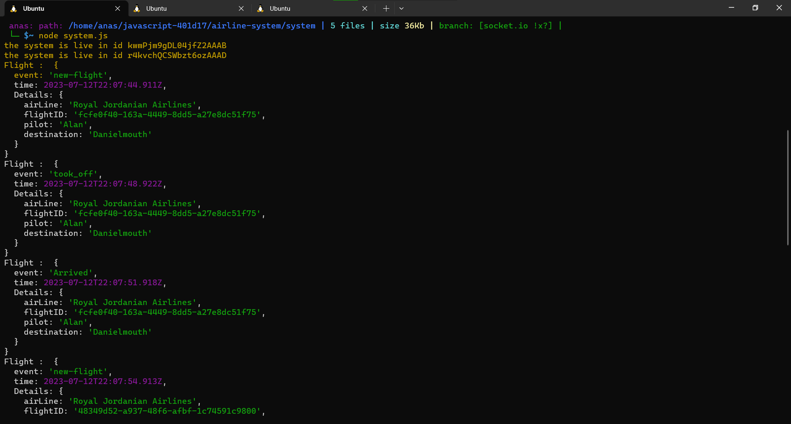
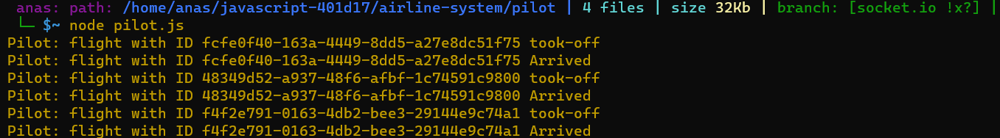
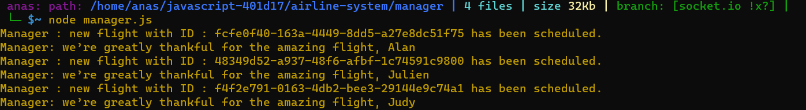

# airline-system 

## Lab 11, 12 and 13 socket.io
### [Lab Requirements](https://github.com/LTUC/amman-javascript-401d17/blob/main/class-12/lab12.md).

### System

### Piolet

### Manager

> for lap 13 run node system.js then node manager.js then wait for the manager to give tow flights foe the pilot to miss then run node pilot.js